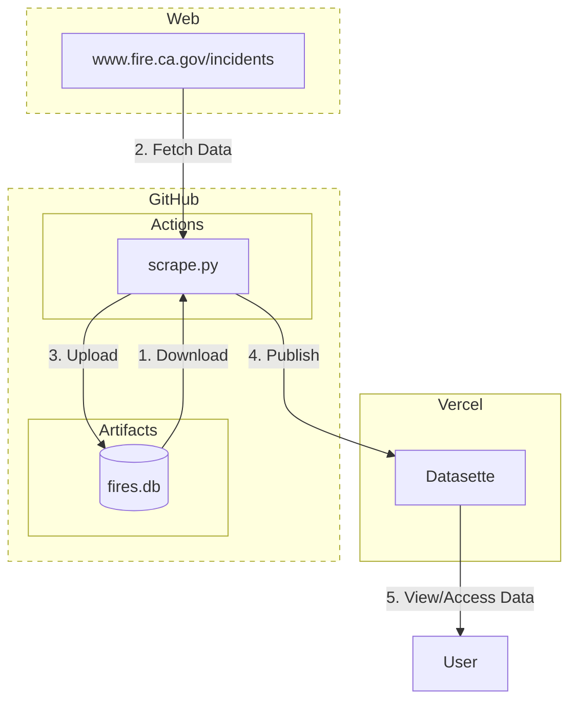

# California Fires History

Tracking fire data from www.fire.ca.gov/incidents.

This project is inspired by and adapts the work from [simonw/ca-fires-history](https://github.com/simonw/ca-fires-history). Instead of using [Git scraping](https://simonwillison.net/2020/Oct/9/git-scraping/), this project stores the data in a SQLite database and uses GitHub artifacts for storage.

## How It Works



## Usage

### Running the Script

To run the script locally and update the database:

```bash
python3 scrape.py
```

### Optional: Running Datasette

To view and explore the data using [Datasette](https://datasette.io/):

```sh
pip install datasette # optional: install Datasette if you haven't already

datasette data/fires.db --metadata data/metadata.json
```
